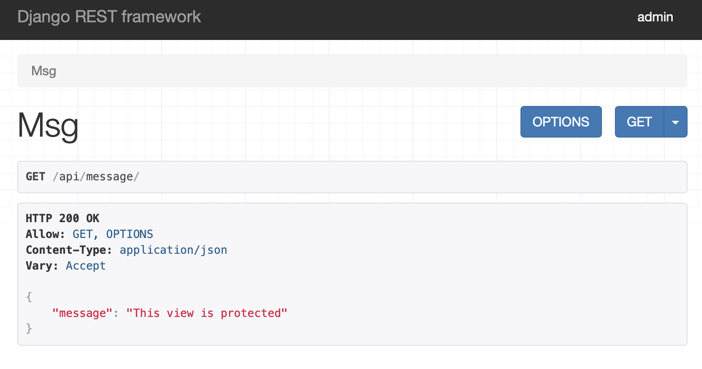

# LittleLemon
This is the capstone project for Coursera's Meta Backend specialization.

## Details
Superuser
- Username: admin
- Password: 1234qwer

Don't forget to set up mysql!

Uusers
1. email1@gmail.com user1 CoUrSeRa123

## API Endpoints
Below contain api endpoints that you can test.

The endpoints 0-4 Were from the first excercise group of the capstone project.

**01 Get Request for Home Page**
`http://127.0.0.1:8002/restaurant/`

**02 Menu Items**
`http://127.0.0.1:8002/restaurant/menu/`

**03 Single Menu Item**
`http://127.0.0.1:8002/restaurant/menu/1`

**04 Booking**
`http://127.0.0.1:8002/restaurant/booking/tables/`

**05 Menu Items**
`http://127.0.0.1:8002/api/menu-items/`

**06 Single Menu Item**
`http://127.0.0.1:8002/api/menu-items/1`

**07 Testing Authorization**

**08 Djoser Authentication**
Endpoints from all the Djoser authentication system are also included.

For example, `http://127.0.0.1:8002/auth/users/`

**09 Admin Page**